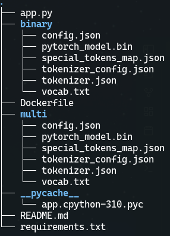

0. move models from storage to app directory
```bash
s3cmd get --recursive s3://models/sentiment/binary/ ./binary/

s3cmd get --recursive s3://models/sentiment/multi/ ./multi/

```

-> scheme of app dir after downloading models:



1. build

```bash 
docker build -f Dockerfile --build-arg PORT=9070 -t hasti-sentiment:latest .
```
**note** you must sync PORT in build-arg and port of `.env.example`

2. run

```bash
docker run -d --env-file=.env.example --name=sentiment-server -p 9070:9070  hasti-sentiment:latest
```

a sample valid input for `/binary` model in cURL:

```bash
curl --location 'http://127.0.0.1:9070/binary' \
--header 'Content-Type: application/x-www-form-urlencoded' \
--data-urlencode 'text=سلام بر شما'
```

and the output of above request:
```json
{
"positive": "0.9901739358901978",
"negative": "0.009826022200286388"
}
```

a sample valid input for `/multi` model in cURL:

```bash
curl --location 'http://127.0.0.1:9070/multi' \
--header 'Content-Type: application/x-www-form-urlencoded' \
--data-urlencode 'text=سلام بر شما'
```

and the output of above request:
```json
{
"furious": "0.000392918533179909",
"angry": "0.0006424056482501328",
"neutral": "0.9976792931556702",
"happy": "0.0008229707600548863",
"delighted": "0.0004624570719897747"
}
```
